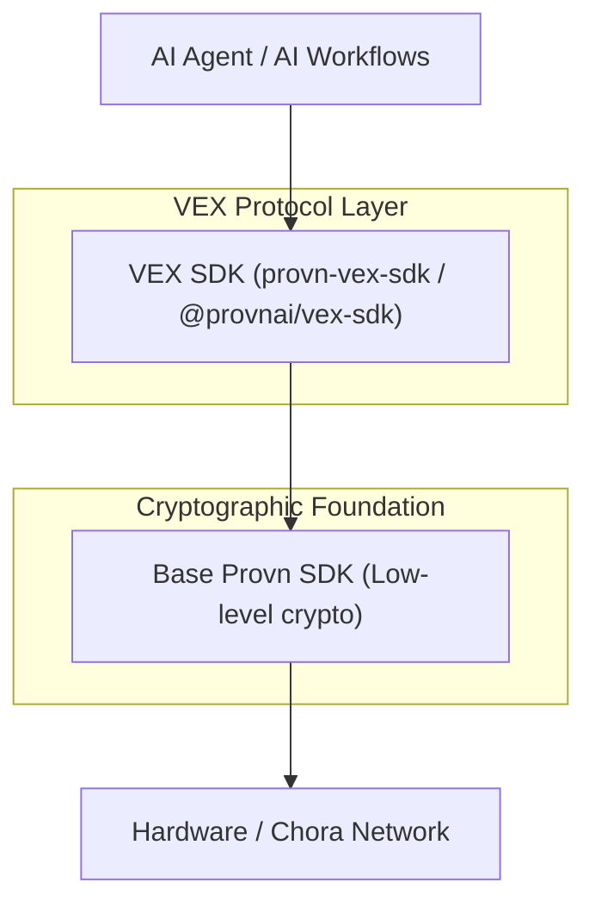
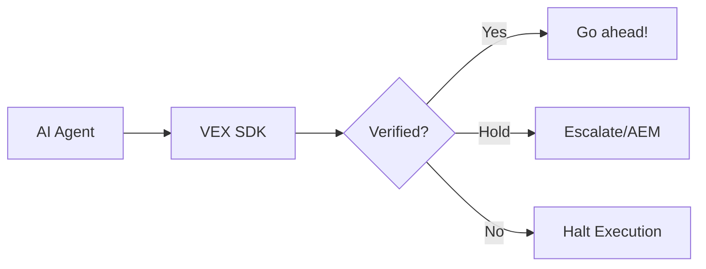

# VEX SDK: Verifiable Execution & Silicon Identity 🛡️⚓

[](https://opensource.org/licenses/Apache-2.0)
[](https://pypi.org/project/provn-vex-sdk/)
[](https://www.npmjs.com/package/@provnai/vex-sdk)
[](https://github.com/provnai/vex-sdk/actions/workflows/ci-python.yml)
[](https://github.com/provnai/vex-sdk/actions/workflows/ci-typescript.yml)

The **VEX SDK** is the official implementation of the Verifiable Execution Protocol. It provides a "black box recorder" for AI agents, making every tool call, decision, and API request mathematically verifiable and cryptographically anchored to hardware.

---

## 🏛️ Core Relationship

- **Provn SDK (`provn-sdk` / `@provncloud/sdk`):** The cryptographic foundation. It handles identity keys, signing, and low-level data anchoring.
- **VEX SDK (`provn-vex-sdk` / `@provnai/vex-sdk`):** The high-level agent protocol. It handles "Intents," "Authorities," and "Capsules." **You use the VEX SDK to build verifiable agents.**



---

## 🛡️ Core Pillars
 
- **Verifiable Execution (VEX v1.6.0):** Generates tamper-proof Evidence Capsules (.capsule) aligned with the latest protocol lockdown for "Titan-grade" assurance.
- **HPKE Intent Privacy:** Industry-standard RFC 9180 encryption (X25519-HKDF-AESGCM) for tool parameters, ensuring zero-knowledge intent dispatch.
- **Silicon Identity (Attest):** Natively integrates hardware-rooted trust (TPM 2.0, Secure Enclaves) to bind actions to specific physical machines.
- **Protocol Parity:** Guaranteed bit-for-bit Merkle and binary parity across Python and TypeScript implementations.
- **High-Assurance Enforcement:** Local Ed25519 signature verification for Gate-issued continuation tokens.

---

## 🚀 Quick Start

### Python

```bash
pip install provn-vex-sdk
```

```python
from provn_vex_sdk import vex_secured

@vex_secured(intent="Critical system update")
async def perform_update(params: dict):
    # Automatically generates and verifies proof before execution
    return await internal_api.update(params)
```

### TypeScript

```bash
npm install @provnai/vex-sdk
```

```typescript
import { vexMiddleware } from '@provnai/vex-sdk';

// Secure Vercel AI SDK or generic tool loops
const securedTools = vexMiddleware({ 
  identityKey: process.env.VEX_KEY!, 
  vanguardUrl: process.env.VEX_VANGUARD_URL! 
});
```

---

## ⚙️ How it works

VEX builds a **.capsule** artifact for every action. This envelope contains:
1. **The Intent:** The objective context of the action.
2. **The Authority:** Permission and governance signals (VEX/CHORA).
3. **Silicon Identity (Attest):** Proof the hardware is genuine and secure.
4. **The Witness:** A timestamped signature from the Chora network.



---

## 🏛️ Monorepo Structure

- **`/python`**: Official Python SDK ([`pip install provn-vex-sdk`](./python)).
- **`/typescript`**: Official TypeScript SDK ([`npm install @provnai/vex-sdk`](./typescript)).
- **`/docs`**: Technical specifications, [Silicon Identity (Attest)](./docs/attest.md) guide, and audit reports.

---

## 🤝 Contributing & Security

We built VEX to be open and auditable. 
- See [CONTRIBUTING.md](./CONTRIBUTING.md) to help us build the future of AI trust.
- See [SECURITY.md](./SECURITY.md) to report vulnerabilities privately.

---

**Developed by ProvnAI as part of the ARIA Scaling Trust programme.**
🛡️⚓🚀
